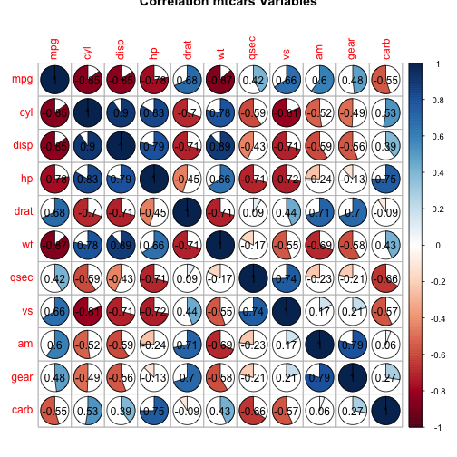

Shiny App - Predicting Fuel Consumption
========================================================
author: Bankbintje
date: 27-09-2015

Summary
========================================================

- This app predicts fuel consumption using a linear regression model based on the mtcars dataset. 
- The app returns the fitted fuel consumption in mpg - including the lower and upper bound values.
- It uses horsepower, car weight, number of cylinders and transmission type as predictors.
- The range of values for the predictors has been limited. The minimum and maximum values of the predictors can not exceed the minimum and maximum values of the variables in the mtcars dataset.

Using the app
========================================================
How to use this app:
- Set the values for **horsepower** and **car weight** by using the sliders in the sidebarPanel on the left side of the screen.
- Select the **number of cylinders** and **transmission type** by using the radiobuttons in the sidebarPanel on the left side of the screen.
- Hit the **Submit** button on the bottom of the sidebarPanel.
- The mainPanel shows the predicted fuel consumption in mpg; including the upper- and lower bounds for the predicted fuel consumption.


Correlation of mtcars variables
========================================================
The following plot depicts the correlations between the variables in the mtcars dataset:

 

The variables **horsepower**, **car weight**, **number of cylinders** and **transmission type** will be used as predictors.

The Linear Regression Model
========================================================
The following model has been used for predicting fuel consumption:


```r
data=mtcars
mtcars$am <- as.factor(mtcars$am)
fit <- (lm(formula = mpg ~ cyl + hp + wt + am, data = mtcars))
```

The Rˆ2 value of the model using nbr of cylinders, horsepower, weight, and transmission type:

```r
summary(fit)$adj.r.squared
```

```
[1] 0.8266657
```

Resources
========================================================

Link to the App: 
https://bankbintje.shinyapps.io/Developing_Data_Products

Link to the paper explaining the regression model: 
https://github.com/MakisPoulianidis/Regression-Models/blob/master/Regression_Models_-_Cars.pdf

Link to the description of the mtcars dataset:
https://stat.ethz.ch/R-manual/R-devel/library/datasets/html/mtcars.html
